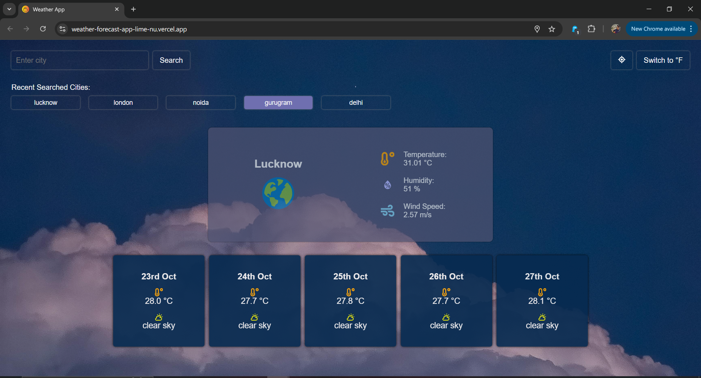
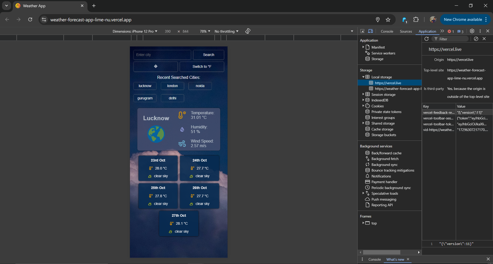

# Weather Dashboard App
This is a responsive weather dashboard application built with React and CSS3, designed to provide users with real-time weather information for cities worldwide. The app retrieves data from the Open-Meteo API and displays detailed weather information such as temperature, humidity, wind speed, and a 5-day forecast.

# Features
1. User Interface
Responsive Design: The app adapts seamlessly to both desktop and mobile devices.
Search Functionality: Users can search for any city to get its current weather data.
Weather Details: Displayed information includes:
Temperature (Celsius/Fahrenheit toggle)
Humidity
Wind Speed
General weather conditions (e.g., sunny, cloudy)

2. API Integration
Open-Meteo API: The app retrieves weather data using the Open-Meteo API.
Error Handling: An error message is displayed if the city is not found or if there are issues with the API request.

3. Additional Features
5-Day Forecast: The app provides a 5-day weather forecast, showing temperature trends and weather conditions.
Geolocation: Users can click a button to fetch and display the weather for their current location using geolocation.
Celsius/Fahrenheit Toggle: Users can switch between Celsius and Fahrenheit temperature displays.
Local Storage: The app saves the last searched cities in the user's local storage for easy access on future visits.

# Technologies Used
React: Frontend framework for building user interfaces.
CSS3: For responsive styling and layout.
JavaScript (ES6+): To handle API calls and dynamic behavior.
Open-Meteo API: To retrieve real-time weather data.
Local Storage: To save and retrieve the user's last searched cities.
HTML5: Markup language for structure.

# Installation
Clone the repository:

git clone https://github.com/yourusername/weather-dashboard-app.git
Navigate into the project directory:

cd weather-dashboard-app
Install the dependencies:

npm install
Start the development server:

npm start
Open your browser and navigate to http://localhost:3000 to view the app.

# Usage
Search for a City: Use the search bar to type in the name of any city and press enter or click the search button. The app will display the current weather data along with a 5-day forecast for that city.
Geolocation: Click on the "Use My Location" button to get the weather of your current location based on geolocation.
Toggle Temperature Units: Switch between Celsius and Fahrenheit by clicking the toggle button.
Access Recent Searches: The app saves your last searched cities, which are displayed for quick access.